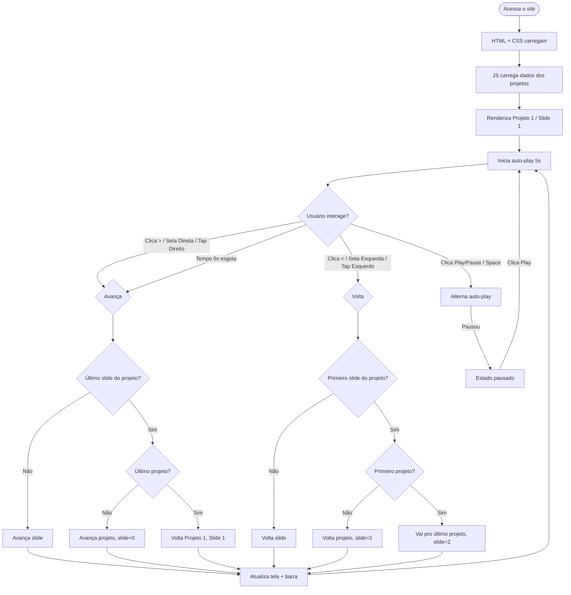

# 🎬 Site de Projetos - Estilo Instagram Stories

## Visão Geral
Site portfólio que apresenta projetos no formato "Instagram Stories" - tela cheia, navegação por setas, auto-play com play/pause.

## Stack
- **HTML5** - Estrutura semântica
- **CSS3** - Estilização responsiva (mobile-first)
- **Vanilla JavaScript** - Lógica de navegação e auto-play
- **GitHub Pages** - Hospedagem

---

## 📁 Estrutura de Arquivos

```
/
├── index.html                          # Página principal
├── assets/
│   ├── css/
│   │   └── style.css                   # Estilos do site
│   ├── js/
│   │   └── script.js                   # Lógica JS (navegação, auto-play)
│   └── images/                         # Imagens baixadas do Drive
│       ├── 01FINANCAS.png
│       ├── 02FINANCAS.png
│       ├── 03FINANCAS.png
│       ├── 01OFICINA.png
│       ├── 02OFICINA.png
│       ├── 03OFICINA.png
│       ├── 01VOLTIN.png
│       ├── 02VOLTIN.png
│       └── 03VOLTIN.png
└── README.md
```

---

## 🎨 Design

### Layout
- **Tela cheia**: story ocupa 100% da viewport
- **Barra de progresso no topo**: segmentada por projetos + slides
- **Imagem centralizada**: com `object-fit: contain` e fundo escuro
- **Navegação**: setas nas laterais, toque no mobile
- **Info overlay**: nome do projeto, descrição e tecnologias na parte inferior

### Estrutura dos Stories
```
Level 1: Projetos (3) → Financeiro | Oficina | Voltin
Level 2: Slides (3 por projeto) → Imagens 01, 02, 03
```

### Barra de Progresso
```
[Proj1/Slide1][Proj1/Slide2][Proj1/Slide3] | [Proj2/Slide1]... | [Proj3/Slide3]
```
- 9 segmentos no total (3 projetos x 3 slides)
- Segmento ativo: animação de preenchimento (5 segundos)
- Ao completar todos os 3 slides de um projeto: avança para próximo projeto
- Ao completar último projeto: volta ao primeiro (loop)

### Cores
```css
--bg-primary: #0a0a0a;
--bg-overlay: rgba(0, 0, 0, 0.6);
--text-primary: #ffffff;
--progress-bg: rgba(255, 255, 255, 0.3);
--progress-fill: #ffffff;
--accent: #0095f6;
```

### Responsividade
- **Mobile first**: < 768px (touch, botões grandes)
- **Desktop**: > 768px (teclado atalhos, hover)

---

## 🧩 Componentes

### 1. Projetos Data (JavaScript)
```javascript
const projects = [
  {
    id: 1,
    name: 'FINANCAS',
    title: 'Sistema Financeiro',
    description: 'Descrição do projeto...',
    techs: ['HTML', 'CSS', 'JavaScript'],
    link: 'https://github.com/cristiancerqueira/financas',
    slides: [
      'assets/images/01FINANCAS.png',
      'assets/images/02FINANCAS.png',
      'assets/images/03FINANCAS.png'
    ]
  },
  // ... OFICINA, VOLTIN
];
```

### 2. Barra de Progresso
- 9 segmentos (3 projetos, 3 slides cada)
- Segmento ativo tem animação de preenchimento
- Ao navegar, segmentos completos ficam preenchidos, futuros vazios

### 3. Navegação
**Desktop:**
- Botões `<` `>` nas laterais (aparecem no hover)
- Teclado: `←` `→`, `Space` play/pause

**Mobile:**
- Tap lado esquerdo = voltar slide
- Tap lado direito = avançar slide
- Botões touch-friendly (mín 44px)

### 4. Auto-play
- 5 segundos por slide
- Botão play/pause canto inferior direito
- Ao pausar: barra de progresso congela

### 5. Informações do Projeto
- Nome do projeto e descrição
- Badges de tecnologias
- Botão "Ver Projeto" (link externo)

---

## ⚙️ Funcionalidades JavaScript

### Estados
| Estado | Descrição |
|--------|-----------|
| `currentProject` | Índice do projeto atual (0 a 2) |
| `currentSlide` | Índice do slide atual (0 a 2) |
| `isPlaying` | Boolean: auto-play ativo? |
| `progressInterval` | Reference do setInterval |
| `projects` | Array de objetos dos projetos |

### Funções

```javascript
navigate(direction)
  - direction: 'next' | 'prev'
  - Se 'next' e não é último slide → avança slide
  - Se 'next' e é último slide → avança projeto, slide=0
  - Se 'prev' e não é primeiro slide → volta slide
  - Se 'prev' e é primeiro slide → volta projeto, slide=2

togglePlay()
  - Alterna entre pausar/continuar auto-play

updateProgress()
  - Anima barra de progresso do segmento atual
  - Ao completar 100% → navigate('next')

renderStory(projectIndex, slideIndex)
  - Atualiza imagem, overlay, barras de progresso
```

---

## 📐 Diagrama de Arquitetura



---

## ✅ TODO List

- [ ] **1. Mover imagens** - Mover as imagens para `assets/images/` (organizar estrutura)
- [ ] **2. Criar `index.html`** - Estrutura HTML com container dos stories, navegação, overlay
- [ ] **3. Criar `assets/css/style.css`** - Estilos completo: layout, responsivo, animações, tema escuro
- [ ] **4. Criar `assets/js/script.js`** - Lógica JS: navegação, auto-play, progresso, teclado, touch
- [ ] **5. Popular dados** - Inserir informações reais dos projetos (nome, descrição, techs, links)
- [ ] **6. Testar localmente** - Abrir no navegador, testar mobile/desktop
- [ ] **7. Deploy GitHub Pages** - Criar repositório, subir arquivos, configurar Pages

---

## 🚀 Deploy GitHub Pages

1. Criar repositório no GitHub (ex: `portfolio` ou `cristiancerqueira.github.io`)
2. Adicionar todos os arquivos ao repositório
3. Settings > Pages > Source: main / branch (root)
4. Site disponível em `https://usuario.github.io/portfolio/`

**⚠️ Imagens devem estar COMMITADAS no repositório, não funcionam via link do Drive.**
